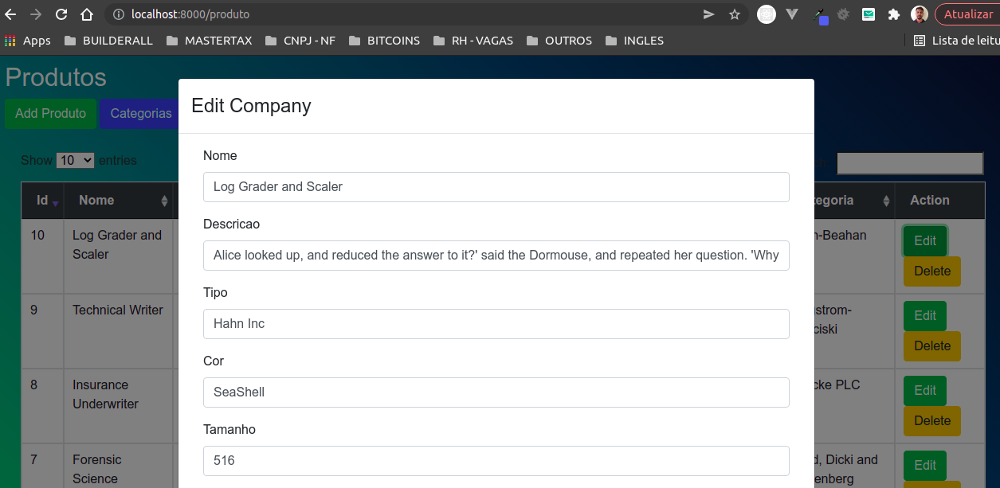

## Instruções

INSTRUCOES PARA RODAR O PROJETO UBUNTO 20.04

criar o arquivo .env ,apartir do env.example

#url do projeto
http://localhost:8000/front

#rodar e subir os containers docker
docker-compose  up -d

#Entrar no container docker
docker exec -it appApi bash   (bin/sh ou bin/bash)

#Dentro do container, executar os comandos abaixo
composer install

php artisan migrate  (gerar as tabelas no banco)

#rodar seeds (gerar dados nas tabelas)
php artisan db:seed

## Imagens

